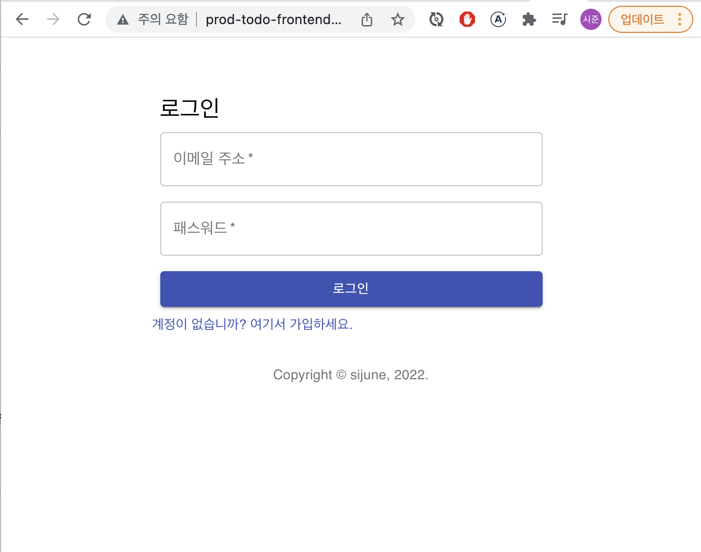
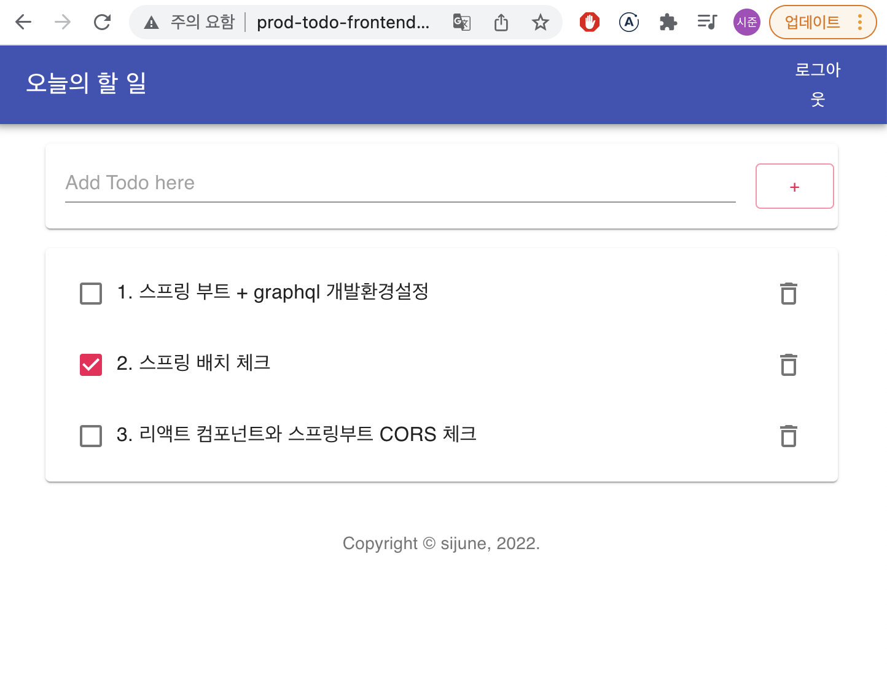

# Todo App 백엔드

React와 Spring Boot를 이용한 간단한 Todo App 구현

- Frontend : React
- Backend : Springboot
- DB : H2(개발), MySQL(운영)
- Infra : AWS Elastic Beanstalk(eb 커맨드라인 사용)
    

## 구현한 사항

- Spring Boot를 이용하여 웹 백엔드 구현
- Gradle을 통한 의존성 세팅 및 빌드 진행
- CORS 문제를 해결 : Spring Boot WebMvcConfig에 오리진 설정
- AWS Elastic Beanstalk을 이용한 배포  
    

## 운영배포한 사항

- 백엔드 배포 url : http://prod-todo-backend.ap-northeast-2.elasticbeanstalk.com/ (현재 서버 DOWN)   

1. 로그인 페이지
      

2. TodoApp 화면
   

---

#### 파일 설명 (기본아키텍처 외)

- WebMvcConfig.java : 프론트엔드 연결서버 지정(개발/운영), 크로스오리진 해결
- WebSecurityConfig.java : 스프링 시큐리티 설정, 접근권한 및 JWT 설정
- JwtAuthenticationFilter.java : 토큰 검증 후 시큐리티 context에 사용자에게 권한 부여(스프링 어플리케이션이 구동되기 전에 filter로 작동한다.)
- TokenProvider.java : JWT 토큰 발행 및 토큰 검증
